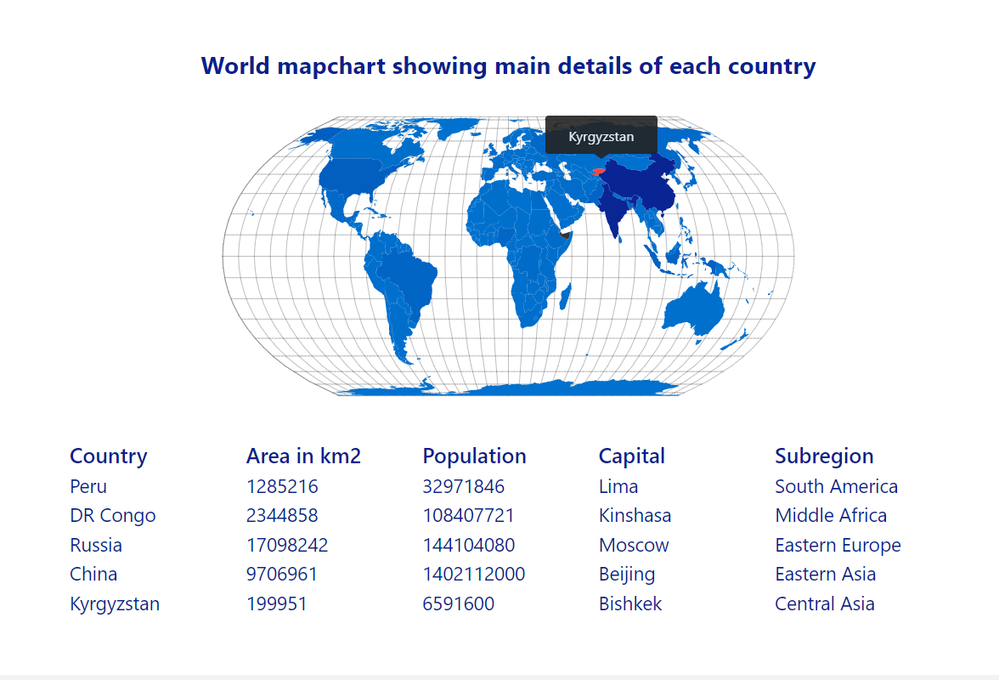

# World mapchart
> World mapchart showing country's main details by clicking on each country 
<!-- > Live demo [_here_](https://www.example.com) -->

## Table of Contents
* [General Info](#general-information)
* [Technologies Used](#technologies-used)
* [Features](#features)
* [Screenshots](#screenshots)
* [Setup](#setup)
* [Usage](#usage)


## General Information
- The purpose of this project is to compare countries' main details


## Technologies Used
- react - version 18.2.0
- react-router-dom - version 6.4.1
- react-simple-maps - version 3.0.0
- d3-scale - version 4.0.2
- react-tooltip - version 4.2.21
- axios - version 0.27.2


## Features
List the ready features here:
- Highlight and show tooltip with name of the country by hovering each country
- Show the detailed information by clicking selected country


## Screenshots



## Setup
After you clone this repo to your desktop, go to its root directory and run ```npm install``` to install its dependencies.

Once the dependencies are installed, you can run ```npm start``` to start the application. You will then be able to access it at localhost:3000
